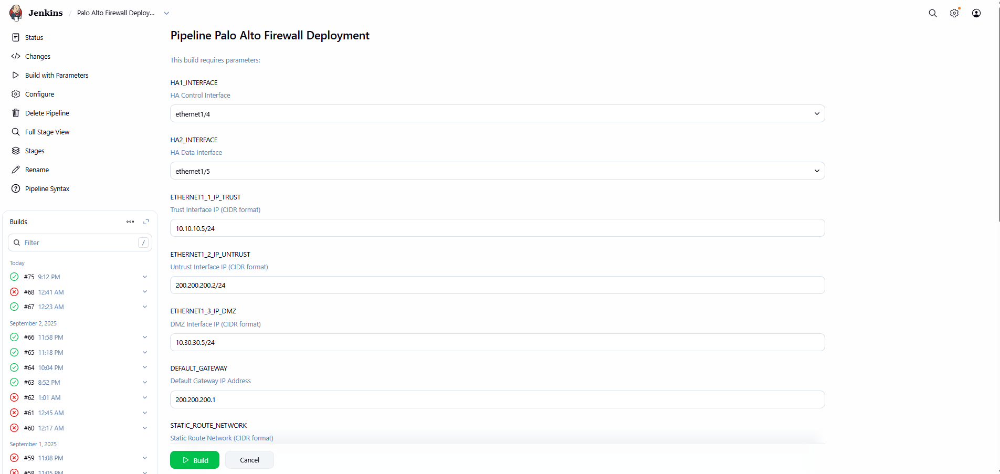
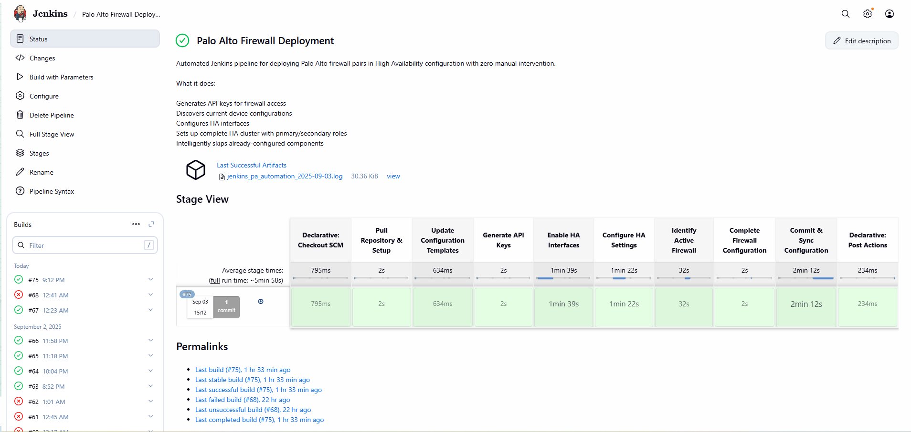
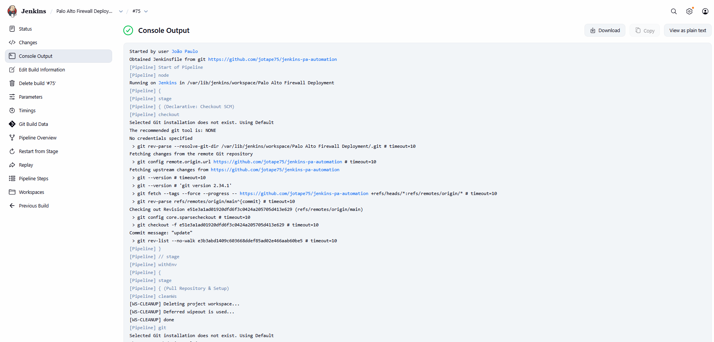

# 🔥🧱 Jenkins Palo Alto Firewall HA Automation

[](https://www.python.org/downloads/)
[](https://opensource.org/licenses/MIT)
[](https://github.com/jotape75/jenkins_PA_automation)
[](https://www.paloaltonetworks.com/)
[](https://jenkins.io/)

A centralized Jenkins-based automation solution for deploying Palo Alto firewall High Availability (HA) pairs with comprehensive network configuration. This is an enhanced version of the [original host-based automation](https://github.com/jotape75/eve-ng_automation_PA), now redesigned for centralized execution through Jenkins CI/CD pipelines.

## 📋 Overview

This automation eliminates the need for manual file modifications by providing a **form-based Jenkins interface** for dynamic configuration. Unlike the [previous version](https://github.com/jotape75/eve-ng_automation_PA) that required running scripts on individual hosts and manual file editing, this solution operates entirely through Jenkins, making firewall deployments consistent, auditable, and easily repeatable.

## ⚡ Key Improvements Over Previous Version

Building upon the foundation of the [eve-ng_automation_PA](https://github.com/jotape75/eve-ng_automation_PA) project, this Jenkins-based solution introduces:

- **🎯 Centralized Execution**: No need to access individual hosts or modify configuration files
- **📋 Form-Based Interface**: All parameters configurable through Jenkins web interface
- **🔧 Dynamic Configuration**: Templates updated automatically using Jenkins parameters
- **📊 Pipeline Visibility**: Real-time progress tracking and comprehensive logging
- **🔒 Secure Credential Handling**: Password management with automatic cleanup
- **📁 Audit Trail**: Automatic artifact archival for compliance and troubleshooting

## 🔄 Evolution from Host-Based Automation

The [original eve-ng_automation_PA](https://github.com/jotape75/eve-ng_automation_PA) automation required:
- Direct host access for script execution
- Manual editing of configuration files and templates
- Individual deployment management per environment
- Limited audit capabilities and logging

This Jenkins-based evolution transforms the deployment process into a **centralized, web-driven workflow** that maintains all the core functionality while adding enterprise-grade automation capabilities.

## 📂 Repository Setup

### 🐙 GitHub Repository
This automation is hosted on GitHub and can be easily integrated into your Jenkins environment:

```bash
# Clone the repository
git clone https://github.com/jotape75/jenkins_PA_automation.git

# Navigate to project directory
cd jenkins_PA_automation

# Install dependencies
pip install -r requirements.txt
```

## 🏗️ Architecture

### 🚀 Pipeline Stages

1. **Repository Setup** - Clone code and install dependencies
2. **Template Processing** - Update XML templates with Jenkins parameters
3. **API Key Generation** - Authenticate with firewall devices
4. **HA Interface Configuration** - Enable HA on specified interfaces
5. **HA Group Setup** - Configure active-passive relationship
6. **Active Firewall Identification** - Determine configuration target
7. **Firewall Configuration** - Apply interfaces, zones, routing, policies, NAT
8. **Commit & Sync** - Deploy configuration and synchronize to HA pair

### 📁 File Structure

```
jenkins_PA_automation/
├── src/
│   ├── main.py                     # Pipeline orchestrator
│   ├── update_templates.py         # Template preprocessing
│   ├── utils_pa.py                 # Shared utilities
│   └── steps/
│       ├── step_01_api_keys.py     # API key generation
│       ├── step_02_ha_interfaces.py # HA interface enablement
│       ├── step_03_ha_config.py    # HA group configuration
│       ├── step_04_identify_active.py # Active firewall detection
│       ├── step_05_firewall_config.py # Complete firewall setup
│       └── step_06_commit.py       # Configuration deployment
├── data/payload/                   # XML configuration templates
│   ├── data_interface.xml          # Interface IP configuration
│   ├── initial_config_template.txt # Basic device configuration
│   ├── paloalto_ha_template_config.xml # HA group configuration
│   ├── paloalto_interface_ha_template.xml # HA interface settings
│   ├── security_policy_template.xml # Inter-zone traffic policies
│   ├── source_nat_template.xml     # NAT rule configurations
│   ├── static_route_template.xml   # Routing configuration
│   ├── virtual_router_template.xml # Virtual router setup
│   └── zones.xml                   # Security zone definitions
├── screenshots/                    # Documentation images
│   ├── consoleoutput.png          # Jenkins console logs
│   ├── formoutput.png             # Parameter form interface
│   └── pipeplineoutput.png        # Pipeline execution view
├── log/                           # Execution logs
├── Jenkinsfile                    # Pipeline definition
├── LICENSE                        # MIT license
├── README.md                      # Project documentation
└── requirements.txt               # Python dependencies
```

### 🔧 Jenkins Integration
1. **Create New Pipeline Job** in Jenkins
2. **Pipeline from SCM** → Select Git
3. **Repository URL**: `https://github.com/jotape75/jenkins_PA_automation.git`
4. **Script Path**: `Jenkinsfile`
5. **Save and Build with Parameters**

## ⚙️ Configuration Parameters

### 🔗 HA Configuration
- **HA1 Interface** - Control plane interface (e.g., `ethernet1/4`)
- **HA2 Interface** - Data plane interface (e.g., `ethernet1/5`)

### 🌐 Network Configuration
- **Trust Interface IP** - Internal network interface IP (e.g., `10.10.10.5/24`)
- **Untrust Interface IP** - External network interface IP (e.g., `200.200.200.2/24`)
- **DMZ Interface IP** - DMZ network interface IP (e.g., `10.30.30.5/24`)

### 🛡️ Routing & Gateway
- **Default Gateway** - Network gateway IP (e.g., `200.200.200.1`)
- **Static Route Network** - Network for static routing (e.g., `10.0.0.0/8`)
- **Static Route Nexthop** - Next hop IP for static route (e.g., `10.10.10.1`)

### 🔒 NAT Configuration
- **Source NAT IP** - IP address for outbound NAT (e.g., `200.200.200.10`)

### 🌐 Interface Zone Assignments
- **Trust Zone Interface** - Trust zone interface assignment (e.g., `ethernet1/1`)
- **Untrust Zone Interface** - Untrust zone interface assignment (e.g., `ethernet1/2`)
- **DMZ Zone Interface** - DMZ zone interface assignment (e.g., `ethernet1/3`)

### 🔥 Firewall Connection
- **Firewall Hosts** - Comma-separated IP addresses (e.g., `192.168.0.226,192.168.0.227`)
- **API Username** - Administrative user for firewall API access (e.g., `api_user`)
- **API Password** - Secure password for authentication

## 🚀 Usage

### 📋 Prerequisites

1. **Jenkins Environment** with Python 3.x support
2. **Network Access** to Palo Alto firewall management interfaces
3. **API User** configured on target firewalls with appropriate permissions

### 🔧 Deployment Process

1. **Access Jenkins Pipeline**
   ```
   Navigate to: Jenkins → New Item → Pipeline
   ```

2. **Configure Parameters**
   - Fill out the form-based interface with network details
   - Specify target firewall IP addresses
   - Provide API credentials

3. **Execute Pipeline**
   ```
   Click "Build with Parameters" → Review settings → "Build"
   ```

4. **Monitor Progress**
   - Real-time stage execution in Jenkins console
   - Detailed logging for each configuration step
   - Automatic artifact collection upon completion

### 💡 Example Configuration

```yaml
Firewall Hosts: 192.168.0.226,192.168.0.227
Trust Interface: ethernet1/1 → 10.10.10.5/24
Untrust Interface: ethernet1/2 → 200.200.200.2/24
DMZ Interface: ethernet1/3 → 10.30.30.5/24
HA1 Interface: ethernet1/4
HA2 Interface: ethernet1/5
Default Gateway: 200.200.200.1
```

## 📸 Screenshots

### 🔧 Jenkins Parameter Form

*Form-based configuration interface - no file editing required*

### 🚀 Pipeline Execution

*Real-time stage progression with detailed logging*

### 📊 Console Output Sample

*Detailed execution logs for troubleshooting and audit*

## ⭐ Key Features

### 🚀 **Zero File Modification**
No need to edit configuration files or templates manually. All customization happens through the Jenkins web interface.

### 🔄 **Template-Driven Configuration**
XML templates are dynamically updated with Jenkins parameters, ensuring consistency and reducing human error.

### 🛡️ **HA-Aware Deployment**
Intelligent configuration targeting - applies settings to the active firewall and automatically synchronizes to the passive device.

### 📊 **Comprehensive Monitoring**
- Real-time commit job tracking
- HA synchronization verification
- Detailed success/failure reporting

### 🔧 **Error Recovery**
- Retry logic for HA establishment
- Graceful handling of commit timeouts
- Fallback mechanisms for edge cases

## 📊 Comparison: Host-Based vs. Jenkins-Based

| Aspect | Previous ([eve-ng_automation_PA](https://github.com/jotape75/eve-ng_automation_PA)) | Current (Jenkins-Based) |
|--------|----------------------|-------------------------|
| **Execution** | Manual script execution on hosts | Centralized Jenkins pipeline |
| **Configuration** | Manual file editing required | Form-based parameter input |
| **Consistency** | Prone to configuration drift | Template-driven consistency |
| **Auditability** | Limited logging and tracking | Complete pipeline audit trail |
| **Accessibility** | Requires host access and expertise | Web-based interface for operators |
| **Scalability** | Manual process for each deployment | Repeatable automated deployments |

## 📝 Logging and Troubleshooting

### 📋 Log Files
- **Execution Logs**: `log/jenkins_pa_automation_YYYY-MM-DD.log`
- **Jenkins Console**: Real-time pipeline output
- **Archived Artifacts**: Post-execution log collection

### ⚠️ Common Issues
- **API Authentication**: Verify credentials and network connectivity
- **HA Establishment**: Allow sufficient time for HA synchronization
- **Template Errors**: Check parameter formatting and placeholder matching

## 🔒 Security Considerations

- **Credential Management**: Passwords are handled securely and cleaned up automatically
- **API Access**: Uses dedicated API users with minimal required permissions
- **Network Security**: Ensure firewall management interfaces are properly secured

## 🔗 Related Projects

- **[eve-ng_automation_PA](https://github.com/jotape75/eve-ng_automation_PA)** - Original host-based automation foundation

## 🤝 Contributing

This automation framework is designed for enterprise firewall deployments. Contributions should focus on:
- Enhanced error handling and recovery
- Additional configuration templates
- Extended monitoring and reporting capabilities
- Integration with network management systems

## 📞 Contact

**João Pinheiro (JP)**

For any questions or support, feel free to reach out:

[](https://github.com/jotape75)
[](mailto:degraus@gmail.com)
[](https://www.linkedin.com/in/joaopaulocp)


🚀 **Follow my work and connect with me!**

## 📄 License

Enterprise deployment automation for Palo Alto Networks firewall infrastructure.